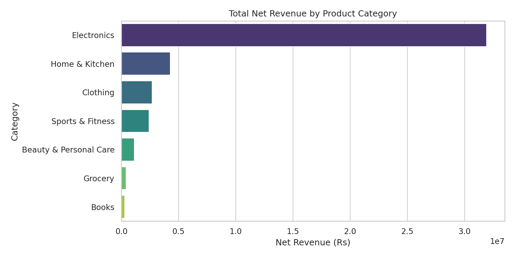
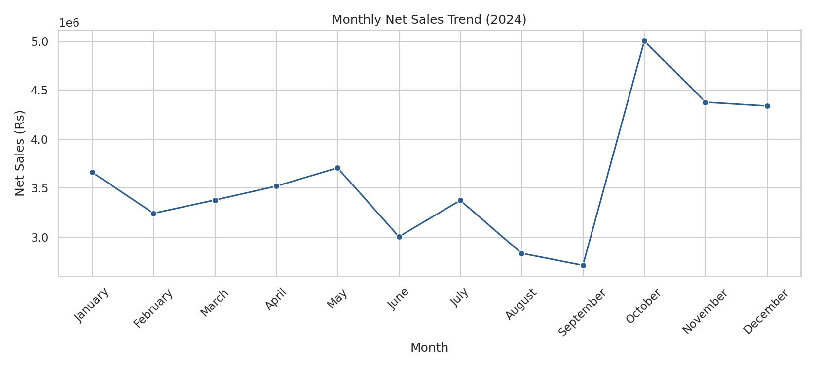

# Sales Data Analysis using Python

Exploratory Data Analysis (EDA) on a multi-category retail sales dataset to identify revenue drivers, seasonal trends, and customer purchase patterns — built to support inventory planning and sales strategy decisions.

## Tools & Libraries
Python · Pandas · NumPy · Matplotlib · Seaborn · Jupyter Notebook

## Dataset
`data/sales_data.csv` — 5,000+ order-level records across 7 product categories, 5 regions, and 5 payment modes, spanning January–December 2024. Includes intentional data quality issues (missing values, duplicates) to demonstrate the cleaning workflow.

## What This Project Covers
- Data cleaning: handling missing values, removing duplicates, feature engineering (month, weekday)
- Revenue analysis by category and region
- Monthly sales trend and seasonality detection
- Discount-level impact on order volume
- Payment mode distribution
- Correlation analysis between price, quantity, discount, and rating
- Customer rating analysis by category

## Key Findings
1. Electronics is the top revenue-generating category despite a lower order count than Clothing, due to higher average order value.
2. Sales spike sharply in October–December (festive season), signaling when to scale inventory and staffing.
3. UPI and Credit Card are the dominant payment modes.
4. Discounts in the 5–10% range drive the best order volume without excessive margin erosion — returns diminish past 15–20%.
5. Customer ratings are stable (4.0–4.3 average) across all categories, indicating no major catalog quality issues.

## How to Run
```bash
pip install pandas numpy matplotlib seaborn jupyter
python generate_data.py        # generates data/sales_data.csv
jupyter notebook Sales_Data_Analysis.ipynb
```

## Sample Output



---
*Part of my Data Analyst portfolio. Dataset is synthetically generated to reflect realistic Indian e-commerce sales patterns.*
